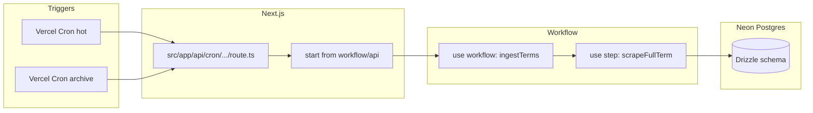
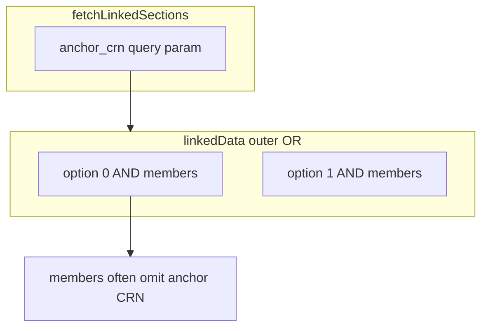

# Banner scrape pipeline (UWYO → Neon, Vercel Cron + Workflow)

## Context from the repo

- Protocol and shapes are already specified in [`docs/banner-ssb-class-search-scraping.md`](docs/banner-ssb-class-search-scraping.md); real field inventory lives in [`docs/banner-ssb-fixtures/07-searchResults-PHYS-page0.json`](docs/banner-ssb-fixtures/07-searchResults-PHYS-page0.json) and [`docs/banner-ssb-fixtures/08-fetchLinkedSections-10224.json`](docs/banner-ssb-fixtures/08-fetchLinkedSections-10224.json).
- The app is Next.js 16 ([`package.json`](package.json)) with App Router under [`src/app/`](src/app/) only; **no** `vercel.json`, DB driver, or scrape code yet.

## Execution model (300s, simplified)

Full terms have on the order of **~140 subjects**; subject discovery via `GET .../classSearch/get_subject` must **paginate with `offset`/`max` (e.g. `max=100`) until the API returns an empty array**—so **at least two pages** of subjects, not a single page.

Across reset + paginated `searchResults` per subject plus linked fetches, total HTTP volume is on the order of **~150 requests per term**, which fits comfortably under the **300s** function limit without splitting work per subject.

**Plan:** one **`"use step"`** implements **entire term ingestion** (session warm → term select → list all subjects with pagination → for each subject: reset + paginate `searchResults` → upsert DB → linked pass for relevant CRNs). A thin **`"use workflow"`** orchestrator only sequences **one step per term** (e.g. hot run: one step; archive run: `for (const term of terms) await scrapeFullTermStep(term)`). No per-subject steps, no `scrape_progress` checkpoints unless you hit real timeouts later.

## High-level architecture

1. **Vercel Cron** (production only) hits a secured Route Handler (e.g. verify `Authorization: Bearer ${CRON_SECRET}` per [Vercel cron docs](https://vercel.com/docs/cron-jobs)).
2. Route calls `start(ingestTermsWorkflow, [payload])` from `workflow/api` (see WDK quickstart pattern).
3. **Workflow** runs **one durable step per term**; all Banner I/O and DB writes for that term live inside that step (full Node, retries on step failure).
4. **Neon** via `DATABASE_URL`; **Drizzle** for schema, migrations (`drizzle-kit`), and type-safe upserts.

## Dependencies and project wiring

- **Database:** `drizzle-orm`, `drizzle-kit`, `@neondatabase/serverless` (or `neon-serverless` driver pairing per current Drizzle Neon docs).
- **Workflow:** `workflow` + `workflow/next` (`withWorkflow` in [`next.config.ts`](next.config.ts)), root **`instrumentation.ts`** to start the workflow runtime on Node (per WDK Next.js setup). Follow the version pinned in the official quickstart when installing.
- **Scraping:** native `fetch` + explicit **cookie jar** (parse/store `Set-Cookie`), header discipline (`User-Agent`, `Referer`, `X-Synchronizer-Token`, `X-Requested-With`) as in [§2–5](docs/banner-ssb-class-search-scraping.md). No Playwright on the server path—pure HTTP is enough and fits functions better.

## Schema (Drizzle) — model “everything,” prioritize relations

Design around Banner’s natural keys and your fixtures:

| Area | Tables / notes |
|------|----------------|
| Terms | `terms` (`code` PK, `description`, `last_full_scrape_at`, `last_hot_scrape_at`) |
| Catalog identity | `courses` — unique `(term_code, subject, course_number)`; optional `subject_course` display string |
| Sections | `sections` — unique `(term_code, crn)`; scalar columns for enrollment, flags, schedule type, titles, `link_identifier`, `is_section_linked`, instructional method, etc.; **`raw_json jsonb`** for forward compatibility with extra Banner keys |
| Meetings | `section_meetings` — FK to section; flatten `meetingsFaculty[].meetingTime` (days booleans, times, building, room, dates) |
| Faculty | `section_faculty` — FK to section; from `faculty[]` |
| Attributes | `section_attributes` — `(code, description)` per section |
| Linked registration | `linked_bundles` — `(term_code, anchor_crn, bundle_index)`; **`linked_bundle_members`** — `(bundle_id, crn, position)` matching `linkedData[i][j]` from [§6](docs/banner-ssb-class-search-scraping.md). See **Linked sections semantics** below. |

### Linked sections semantics (Banner `linkedData`)

Banner `GET .../fetchLinkedSections` returns `{ "linkedData": [ ... ] }` ([§6](docs/banner-ssb-class-search-scraping.md)):

- **Outer array index `i` — mutually exclusive options (OR).** Each `linkedData[i]` is one **valid registration option** the university treats as equivalent to any other outer option for satisfying linked registration (e.g. pick one discussion/lab pair among many).
- **Inner array — co-required sections (AND).** All sections in `linkedData[i][j]` for `j = 0..n-1` must be taken **together** if that option is chosen.
- **`anchor_crn` is query provenance, not “parent row of every member.”** It is the `courseReferenceNumber` passed to `fetchLinkedSections`. In [`docs/banner-ssb-fixtures/08-fetchLinkedSections-10224.json`](docs/banner-ssb-fixtures/08-fetchLinkedSections-10224.json) (anchor lecture `10224`), **no inner bundle includes `10224`** — each outer bundle is only discussion + lab rows. Product logic for a student holding the anchor section is typically **anchor + exactly one chosen inner bundle** (unless you model the anchor only in `sections` and options only in `linked_*` tables).
- **`linkIdentifier` on section rows** (e.g. `D1` vs `L1` within one bundle) labels **slots / roles** inside an AND-bundle, **not** the OR-option group. The OR-group is **only** the outer `linkedData` index. Do not merge or dedupe “linked options” by `linkIdentifier` alone across the course.
- **Inner length** may be `1` or more; rows are usually full `searchResults`-shaped objects but can be sparse in edge cases — mappers must tolerate variable inner length.

**Important modeling notes:**

- `linkIdentifier` alone is **not** globally unique ([§7](docs/banner-ssb-class-search-scraping.md)). Store it on `sections` for display/debug, but **option identity** should tie to `(term_code, anchor_crn, bundle_index)` plus member CRNs (not to `linkIdentifier` across courses).
- **Stable identity (optional later):** outer-array order is usually stable but is still API presentation order; if rescrapes must reconcile options without relying on index alone, add a canonical signature (e.g. sorted member CRNs scoped by `anchor_crn`).

**Indexes:** `(term_code, subject)`, `(term_code, is_section_linked)`, `(term_code, link_identifier)` for job selection; GIN on `raw_json` only if you later need sparse queries.

## Scrape logic (inside the single term step)

Shared **Banner session** for the whole step (refresh token + `GET classSearch/classSearch` mid-run only if you see 401/403 or long runs, per [§9](docs/banner-ssb-class-search-scraping.md)):

1. `GET .../term/termSelection?mode=search` → token.
2. `POST .../term/search` with target `term`.
3. `GET .../classSearch/classSearch` → refresh token + **Referer**.
4. **List subjects:** loop `GET .../classSearch/get_subject` with increasing `offset` until `[]` (with `max=100`, expect **≥2 pages** for ~140 subjects).
5. **For each subject:** `POST classSearch/resetDataForm`, paginate `searchResults` with **offset += data.length** ([§5–6](docs/banner-ssb-class-search-scraping.md)), upsert sections + child rows (per subject or batched commits—your choice inside the one step).
6. **Linked pass:** for linked sections, `GET .../fetchLinkedSections`; **bucket by `(term, subject, course_number, link_identifier)`** before choosing representative anchor CRNs per bucket ([§7](docs/banner-ssb-class-search-scraping.md)). **Dedupe fetches:** one course can surface multiple `linkIdentifier` values (e.g. lecture `A1`, lab `L1`, discussion `D1` on PHYS 1110). Track `(term, subject, course_number)` (or a hash of the set of linked CRNs seen in `searchResults`) so you **do not call `fetchLinkedSections` redundantly** for the same option matrix when several buckets share one underlying linked set. Merge/upsert `linked_bundles` idempotently on `(term_code, anchor_crn, bundle_index)` (or your chosen stable key).

**Idempotency:** upserts keyed on `(term, crn)` and bundle natural keys; update `terms.last_*_scrape_at` when the term step completes.

## Scheduling behavior (your requirement)

- **Hot cron** (e.g. 3× daily UTC): workflow with **one term** (primary from `getTerms` or `BANNER_PRIMARY_TERM_CODE`).
- **Archive cron** (e.g. daily off-peak): same workflow stepping **once per non-primary term** in sequence (each step still one full term).

Optional: archive runs skip linked refetch or run it less often—controlled by workflow payload.

## Files / directories to add (concrete)

- [`src/db/schema.ts`](src/db/schema.ts) — Drizzle tables above
- [`src/db/index.ts`](src/db/index.ts) — Neon client + `drizzle()` instance
- [`drizzle.config.ts`](drizzle.config.ts) — `drizzle-kit` config
- [`src/lib/banner-ssb/`](src/lib/banner-ssb/) — client: cookie jar, token parse, typed responses, retries/backoff ([§9](docs/banner-ssb-class-search-scraping.md))
- [`src/lib/banner-ssb/mappers.ts`](src/lib/banner-ssb/mappers.ts) — map JSON row → insert shapes + `raw_json`
- [`src/workflows/ingest-terms.ts`](src/workflows/ingest-terms.ts) — `"use workflow"` + single `"use step"` `scrapeFullTerm(termCode, options)` (or colocated in one module)
- [`src/app/api/cron/banner-ingest/route.ts`](src/app/api/cron/banner-ingest/route.ts) — GET handler: auth + `start(...)`
- [`vercel.json`](vercel.json) — `crons` entries for hot + archive schedules
- Update [`.env.example`](.env.example): `DATABASE_URL`, `BANNER_ORIGIN` (e.g. `https://wyossb.uwyo.edu`), `CRON_SECRET`, optional `BANNER_PRIMARY_TERM_CODE`

## Testing

- **Unit tests** with Vitest: parse + map fixture JSON files from `docs/banner-ssb-fixtures/` into normalized rows (no network).
- **Linked payload:** assert on [`08-fetchLinkedSections-10224.json`](docs/banner-ssb-fixtures/08-fetchLinkedSections-10224.json): `linkedData.length === 49`; each inner array length `2`; anchor CRN `10224` appears **nowhere** in member rows; outer index maps to OR-options, inner positions to AND-members; member `linkIdentifier` values differ within a bundle (`D1` / `L1`) per fixture.
- Optional: thin integration test behind `BANNER_INTEGRATION=1` hitting real SSB (skipped in CI).

## Ops / compliance

- Bounded retries and hard page caps as in your doc ([§9–10](docs/banner-ssb-class-search-scraping.md)); inter-request delays can stay **minimal** given the ~150-request budget (tune if Banner rate-limits).
- Document in code comments that scraping must respect UW institutional policies (already noted in the doc disclaimer).

## What you will do manually outside the repo

- Create Neon database and set `DATABASE_URL` on Vercel (and local `.env.local`).
- Deploy to Vercel production so crons activate; ensure `CRON_SECRET` matches the cron route check.
